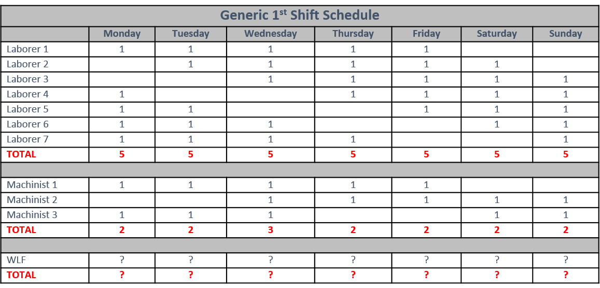
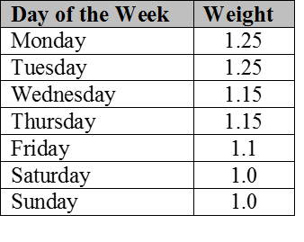

##Background

Burlington Northern Santa Fe Railway (BNSF) 'is one of the biggest railroads in North America, serving the western two-thirds of the U.S.  The company is also one of the oldest, dating back more than 160 years when predecessor railroads were catalysts for settlement and growth in the West.  Throughout its history, BNSF has continuously sought new and innovative ways to transport the products and goods needing delivery to American and global producers and consumers.  This never-ending quest has led to new technologies that improve operations and enhance stewardship.'

At the Hauser Mainline Fueling Depot (Hauser MFD) in Rathdrum, ID, opportunities to improve production are present.  Hauser MFD operates 24 hours a day, 7 days a week, 52 weeks a year.  This fueling depot is not only a vital component for the Northern Transcontinental Railroad System, but also rare in its entirety.  In laymen terms, Hauser MFD is a high-tech gas station for trains and locomotives.  The Mechanical Team at Hauser MFD services on average 40 trains per day, which equates to approximately 85 locomotives and just over 200,000 gallons of diesel fuel dispensed.  In comparison with a gas station, Hauser MFD dispenses enough diesel fuel in a 24 hour span to fill 12,500 vehicles (16 gallon gas tanks on average) from empty to full.  These eye-popping numbers express not only the sheer volume, but also the velocity at which the fueling depot services trains.

For the railroad industry, Hauser MFD must be able to operate at full capacity at any and all times if need be.  A major component of high production is manpower.  It's pertinent for train velocity to have proper staffing each shift with the right number of personnel each day.  Since the inception of Hauser MFD in 2004, shift schedules have been fairly concrete with little fluidity.  With the improving state of the United States economy over the past few years, transportation services have been in higher demand.  These increased volumes have began to expose inefficiencies in the railroad industry, including the manpower distribution at Hauser MFD.

There are three types of non-exempt positions available at Hauser MFD: Diesel Engine Mechanic (Machinist), General Laborer (Laborer), and Working Labor Foreman (WLF).  Each of these positions are unique, while all encompass certain tasks that are equally shared.  From an operating standpoint, the WLF position is vital for smooth performance and high productivity.  This job supports the on-duty supervisor and is responsible for keeping the fueling depot in order.  Each shift has one WLF dedicated to that particular rotation.  A standard work week for non-exempt employees at BNSF Railway is 5 days on and 2 days off.  As stated before, Hauser MFD is open 7 days a week, so employees' 2 rest days could be any two consecutive days in the week.  Below is a screenshot of a generic shift schedule without the employee's names included.  A "1" represents a work day and a blank cell represents a rest day:



Minimum staffing requirements call for 4 laborers and 2 machinists.  For the majority of locomotive services, machinists are able to finish quicker than laborers so laborers are staffed slightly higher to maintain pace.  Hauser MFD does not require a WLF on each shift every day because the on-duty supervisor can complete the work on the respective WLF's rest days.  Currently, the 1st shift WLF at Hauser MFD has Wednesday/Thursday rest days.  Analysis on what days would be the optimal days off for the WLF has never been completed. As shown above, question marks are in all of the cells for the WLF.  The only portion of the schedule that allows for fluidity and change is in the WLF position.

##Objective
The objective of this analysis is to find the optimal rest days for Hauser Mainline Fueling Depot's 1st shift working labor foreman.

```{r,echo=FALSE, warning=FALSE,message=FALSE}
library(dplyr)
library(ggplot2)
library(ggmap)
library(gridExtra)
library(reshape2)
library(tm)
library(stringr)
library(scales)
library(googleVis)
library(datasets)
library(rCharts)
library(devtools)
library(googleVis)
library(lubridate)
```

```{r,echo=FALSE, warning=FALSE,message=FALSE}

#Import data sets.
Shift1 = read.csv("C:/Users/b021494/Desktop/DataViz/GitHub/Individual Project/Shift1.csv")

#Clean and format datasets.
Shift1$Date <- as.Date(Shift1$Date,format='%m/%d/%Y')

Shift1$Gallons..Dispensed <- as.integer(gsub(",","",Shift1$Gallons..Dispensed))

Shift1$Month...Year <- as.factor(Shift1$Month...Year)

Shift1$Year <- as.factor(Shift1$Year)

Shift1$Day.of.the.Week <- as.factor(Shift1$Day.of.the.Week)

Shift1$Shortest.Servicing.Time <- hour(hms(as.character(Shift1$Shortest.Servicing.Time)))*60+minute(hms(as.character(Shift1$Shortest.Servicing.Time)))

Shift1$Longest.Servicing.Time <- hour(hms(as.character(Shift1$Longest.Servicing.Time)))*60+minute(hms(as.character(Shift1$Longest.Servicing.Time)))

Shift1$Mech.Idle..M3 <- hour(hms(as.character(Shift1$Mech.Idle..M3)))*60+minute(hms(as.character(Shift1$Mech.Idle..M3)))

Shift1$Mech.Idle.HE.M4.6 <- hour(hms(as.character(Shift1$Mech.Idle.HE.M4.6)))*60+minute(hms(as.character(Shift1$Mech.Idle.HE.M4.6)))

Shift1$Mech.Idle.DP.M4.6 <- hour(hms(as.character(Shift1$Mech.Idle.DP.M4.6)))*60+minute(hms(as.character(Shift1$Mech.Idle.DP.M4.6)))

Shift1$Mech.Idle..M4.6 <- hour(hms(as.character(Shift1$Mech.Idle..M4.6)))*60+minute(hms(as.character(Shift1$Mech.Idle..M4.6)))

Shift1$Mech.Idle.Total <- hour(hms(as.character(Shift1$Mech.Idle.Total)))*60+minute(hms(as.character(Shift1$Mech.Idle.Total)))

Shift1$SML.Time.M3 <- hour(hms(as.character(Shift1$SML.Time.M3)))*60+minute(hms(as.character(Shift1$SML.Time.M3)))

Shift1$SML.Time.M4.6 <- hour(hms(as.character(Shift1$SML.Time.M4.6)))*60+minute(hms(as.character(Shift1$SML.Time.M4.6)))

Shift1$SML.Time.Total <- hour(hms(as.character(Shift1$SML.Time.Total)))*60+minute(hms(as.character(Shift1$SML.Time.Total)))

Shift1$Mech.Dwell.M3 <- hour(hms(as.character(Shift1$Mech.Dwell.M3)))*60+minute(hms(as.character(Shift1$Mech.Dwell.M3)))

Shift1$Mech.Dwell.M4.6 <- hour(hms(as.character(Shift1$Mech.Dwell.M4.6)))*60+minute(hms(as.character(Shift1$Mech.Dwell.M4.6)))

Shift1$Mech.Dwell.Total <- hour(hms(as.character(Shift1$Mech.Dwell.Total)))*60+minute(hms(as.character(Shift1$Mech.Dwell.Total)))

Shift1$Trans.Idle.Time.M3 <- hour(hms(as.character(Shift1$Trans.Idle.Time.M3)))*60+minute(hms(as.character(Shift1$Trans.Idle.Time.M3)))

Shift1$Trans.Idle.Time.M4.6 <- hour(hms(as.character(Shift1$Trans.Idle.Time.M4.6)))*60+minute(hms(as.character(Shift1$Trans.Idle.Time.M4.6)))

Shift1$Trans.Idle.Time.Total <- hour(hms(as.character(Shift1$Trans.Idle.Time.Total)))*60+minute(hms(as.character(Shift1$Trans.Idle.Time.Total)))

```

## Analysis

The strongest variable relating to the intensity and volume of a day is represented by the total number of locomotives serviced per day.  This variable will be the basis of the analysis.  The graph below represents the average number of locomotives serviced for each day of the week from the start of 2011 through the end of November 2014.  It is apparent from this graph that the days with the highest volume reside on the weekends.

```{r,echo=FALSE, warning=FALSE,message=FALSE}
#Locomotives serviced per day 2011-2014.

dayAverage = aggregate(. ~ Day.of.the.Week, Shift1, function(x) mean(as.numeric(x)))

dayAverage <- transform(dayAverage, Day.of.the.Week = factor(Day.of.the.Week, levels = c("Monday","Tuesday","Wednesday","Thursday","Friday","Saturday","Sunday")))

ggplot(dayAverage,aes(x=Day.of.the.Week,y=Total.Locomotives.Serviced, fill=Day.of.the.Week)) + geom_bar(stat="identity") + ggtitle("Total Locomotives Serviced Per Day (2011-2014)") + theme(legend.position="none") + theme_bw() + xlab("Days of the Week") + ylab("Average # of Locomotives") + theme(axis.text.x = element_text(angle=-90))

```

When servicing locomotives, the task that takes the longest to complete is fueling the locomotive. If the average amount of fuel added to each locomotive is significantly greater on particular days, this will affect the overall volume of the fueling facility.

```{r,echo=FALSE, warning=FALSE,message=FALSE}

gallons <- gvisBarChart(dayAverage, xvar = "Day.of.the.Week", yvar = "Gallons.per.Locomotive", options=list(width=750, height=400, title="Average Gallons added per Locomotive",titleTextStyle="{color:'orange', fontSize:20}", legend="{position: 'none'}"))

plot(gallons)
print(gallons,file="gallons.html")

```
<iframe src="gallons.html" width="800" height="500"></iframe>

The difference between the smallest and largest averages is approximately 5.7%.  For this analysis, a difference smaller than 10% can be negated and will not affect the overall outcome of the decision.  Therefore, the average number of gallons dispensed into each locomotive will be disregarded as a dependent variable.

The railroad industry fluxates with the changing global economy, which can be seen with the increases and decreases in overall train traffic volumes.  Being able to accurately forecast the future volume by analyzing the past will help support which rest days are best for the 1st shift working labor foreman.  The display below represents the daily locomotive servicing averages for each day of the week over the past four years.


```{r,echo=FALSE, warning=FALSE,message=FALSE}

monthAverage = aggregate(cbind(Weight, Month...Year, Total.Locomotives.Serviced) ~ Year+Day.of.the.Week, Shift1, function(x) mean(as.numeric(x)))

monday = monthAverage[monthAverage$Day.of.the.Week=="Monday",]
tuesday = monthAverage[monthAverage$Day.of.the.Week=="Tuesday",]
wednesday = monthAverage[monthAverage$Day.of.the.Week=="Wednesday",]
thursday = monthAverage[monthAverage$Day.of.the.Week=="Thursday",]
friday = monthAverage[monthAverage$Day.of.the.Week=="Friday",]
saturday = monthAverage[monthAverage$Day.of.the.Week=="Saturday",]
sunday = monthAverage[monthAverage$Day.of.the.Week=="Sunday",]

p1 = ggplot(monday,aes(x=Year,y=Total.Locomotives.Serviced, fill=Year)) + geom_bar(stat="identity") + ggtitle("Monday") + theme(legend.position="none") + theme_bw() + xlab("Year") + ylab("Locomotives") + theme(legend.position="none") + theme(axis.text.x = element_text(angle=-90))

p2 = ggplot(tuesday,aes(x=Year,y=Total.Locomotives.Serviced, fill=Year)) + geom_bar(stat="identity") + ggtitle("Tuesday") + theme(legend.position="none") + theme_bw() + xlab("Year") + ylab("Locomotives") + theme(legend.position="none") + theme(axis.text.x = element_text(angle=-90))

p3 = ggplot(wednesday,aes(x=Year,y=Total.Locomotives.Serviced, fill=Year)) + geom_bar(stat="identity") + ggtitle("Wednesday") + theme(legend.position="none") + theme_bw() + xlab("Year") + ylab("Locomotives") + theme(legend.position="none") + theme(axis.text.x = element_text(angle=-90))

p4 = ggplot(thursday,aes(x=Year,y=Total.Locomotives.Serviced, fill=Year)) + geom_bar(stat="identity") + ggtitle("Thursday") + theme(legend.position="none") + theme_bw() + xlab("Year") + ylab("Locomotives") + theme(legend.position="none") + theme(axis.text.x = element_text(angle=-90))

p5 = ggplot(friday,aes(x=Year,y=Total.Locomotives.Serviced, fill=Year)) + geom_bar(stat="identity") + ggtitle("Friday") + theme(legend.position="none") + theme_bw() + xlab("Year") + ylab("Locomotives") + theme(legend.position="none") + theme(axis.text.x = element_text(angle=-90))

p6 = ggplot(saturday,aes(x=Year,y=Total.Locomotives.Serviced, fill=Year)) + geom_bar(stat="identity") + ggtitle("Saturday") + theme(legend.position="none") + theme_bw() + xlab("Year") + ylab("Locomotives") + theme(legend.position="none") + theme(axis.text.x = element_text(angle=-90))

p7 = ggplot(sunday,aes(x=Year,y=Total.Locomotives.Serviced, fill=Year)) + geom_bar(stat="identity") + ggtitle("Sunday") + theme(legend.position="none") + theme_bw() + xlab("Year") + ylab("Locomotives")  + theme(legend.position="none") + theme(axis.text.x = element_text(angle=-90))

grid.arrange(p1, p2, p3, p4, p5, p6, p7, ncol=4)

```

It is apparent from these graphs that Saturday's and Sunday's seem to see the largest volume of locomotives.  Based off my working experience at Hauser, I do not believe the busiest days at the fueling depot are on the weekend.  When I say "busy", I am speaking in terms of not only servicng locomotives, but also in regards to phone traffic, radio traffic, emails, and servicing requests from the corporate headquarters.  The combination of these items ultimately determines how intense the fueling foreman's day will be.  Notoriously, all items except for the number of locomotives needing service are at higher volumes during the week so I added weights to each day of the week.  The table below shows each day of the week and their respective weights.



Using these weights, a more accurate value for the volume of work completed in a single day.  The weighted average for locomotives serviced is plotted for each of the days of the week for the past four years.


```{r,echo=FALSE, warning=FALSE,message=FALSE}

weightedAverage = monthAverage %>%
  mutate(Weighted_Loco_Average = Weight*Total.Locomotives.Serviced)

mondayW = weightedAverage[weightedAverage$Day.of.the.Week=="Monday",]
tuesdayW = weightedAverage[weightedAverage$Day.of.the.Week=="Tuesday",]
wednesdayW = weightedAverage[weightedAverage$Day.of.the.Week=="Wednesday",]
thursdayW = weightedAverage[weightedAverage$Day.of.the.Week=="Thursday",]
fridayW = weightedAverage[weightedAverage$Day.of.the.Week=="Friday",]
saturdayW = weightedAverage[weightedAverage$Day.of.the.Week=="Saturday",]
sundayW = weightedAverage[weightedAverage$Day.of.the.Week=="Sunday",]

w1 = ggplot(mondayW,aes(x=Year,y=Weighted_Loco_Average, fill=Year)) + geom_bar(stat="identity") + ggtitle("Monday") + theme(legend.position="none") + theme_bw() + xlab("Year") + ylab("Locomotives") + theme(legend.position="none") + theme(axis.text.x = element_text(angle=-90))

w2 = ggplot(tuesdayW,aes(x=Year,y=Weighted_Loco_Average, fill=Year)) + geom_bar(stat="identity") + ggtitle("Tuesday") + theme(legend.position="none") + theme_bw() + xlab("Year") + ylab("Locomotives") + theme(legend.position="none") + theme(axis.text.x = element_text(angle=-90))

w3 = ggplot(wednesdayW,aes(x=Year,y=Weighted_Loco_Average, fill=Year)) + geom_bar(stat="identity") + ggtitle("Wednesday") + theme(legend.position="none") + theme_bw() + xlab("Year") + ylab("Locomotives") + theme(legend.position="none") + theme(axis.text.x = element_text(angle=-90))

w4 = ggplot(thursdayW,aes(x=Year,y=Weighted_Loco_Average, fill=Year)) + geom_bar(stat="identity") + ggtitle("Thursday") + theme(legend.position="none") + theme_bw() + xlab("Year") + ylab("Locomotives") + theme(legend.position="none") + theme(axis.text.x = element_text(angle=-90))

w5 = ggplot(fridayW,aes(x=Year,y=Weighted_Loco_Average, fill=Year)) + geom_bar(stat="identity") + ggtitle("Friday") + theme(legend.position="none") + theme_bw() + xlab("Year") + ylab("Locomotives") + theme(legend.position="none") + theme(axis.text.x = element_text(angle=-90))

w6 = ggplot(saturdayW,aes(x=Year,y=Weighted_Loco_Average, fill=Year)) + geom_bar(stat="identity") + ggtitle("Saturday") + theme(legend.position="none") + theme_bw() + xlab("Year") + ylab("Locomotives") + theme(legend.position="none") + theme(axis.text.x = element_text(angle=-90))

w7 = ggplot(sundayW,aes(x=Year,y=Weighted_Loco_Average, fill=Year)) + geom_bar(stat="identity") + ggtitle("Sunday") + theme(legend.position="none") + theme_bw() + xlab("Year") + ylab("Locomotives")  + theme(legend.position="none") + theme(axis.text.x = element_text(angle=-90))

grid.arrange(w1, w2, w3, w4, w5, w6, w7, ncol=4)

```

Using the 2014 U.S. econcomy as a basis for future forecasting, the graph below shows that the two busiest day shifts at the Hauser Mainline Fueling Depot are Monday and Thursday.  As discussed before, each employee is entitled to two consecutive rest days.  Therefore, the two consecutive days that are the busiest are Monday and Tuesday.

```{r,echo=FALSE, warning=FALSE,message=FALSE}

weighted2014 = weightedAverage %>%
  mutate(Weighted_Loco_Average = Weight*Total.Locomotives.Serviced) %>%
  filter(Year=="2014")

weighted2014 <- gvisBarChart(weighted2014, xvar = "Day.of.the.Week", yvar = "Weighted_Loco_Average", options=list(width=750, height=400, title="Weighted Average Locomotive Total",titleTextStyle="{color:'orange', fontSize:20}", legend="{position: 'none'}"))

plot(weighted2014)
print(weighted2014,file="weighted2014.html")
```
<iframe src="weighted2014.html" width="800" height="500"></iframe>

##Conclusion
In closing, the two most beneficial days to have the Hauser Mainline Fueling Depot 1st shift working labor foreman's rest days would be Friday and Saturday.